# Save Your Golden hour (SYGnal Safe-Net 2021)  
> 재난안전통신망 서비스 아이디어 공모전  

# 골든타임 확보를 위한 응급구조 통합 웹플랫폼  

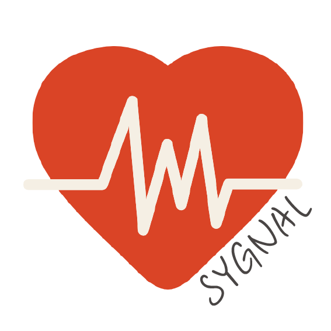

#### SYGnal page https://sygnaling.shop/sygnaling/index.php

__Save Your Golden hour (SYGnal)__

__구급 대원-병원 간 환자/병원 정보를 공유하고 신속한 환자 이송 및 치료에 차질이 없도록 하는 응급구조 통합 플랫폼 입니다.__

It is an emergency rescue integrated platform that shares patient/hospital information between emergency personnel and hospitals and ensures rapid patient transport and treatment.

서울특별시 구로구로 지역을 설정하여 해당 지역의 권역외상센터인 고려대학교 구로병원과 이대목동병원을 기준으로 설정하였습니다.

## 👨 💻프로젝트 주요 내용
 ● 응급 구조 통합 플랫폼 메인 화면

  
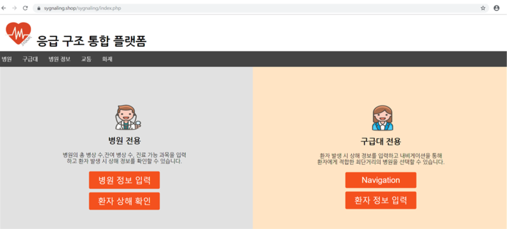

 ● (병원용) 병원 병상수 및 진료가능과목 업데이트
 
 
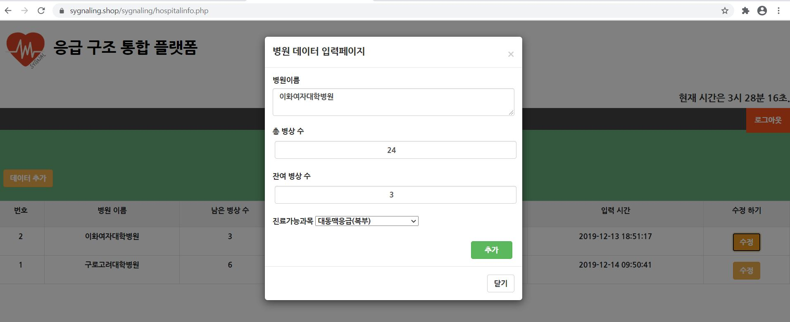

 ● (병원용) 환자 상해 정보 확인
 
 
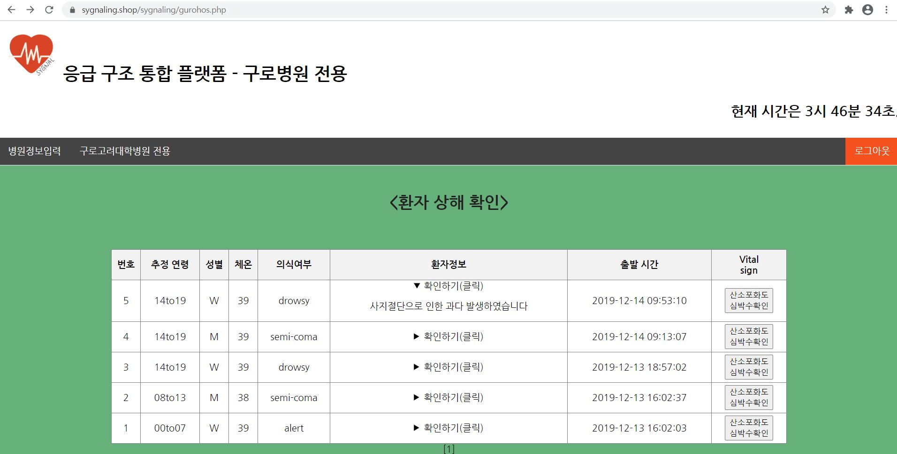

 ● (구급대용) 응급환자에게 적합한 병원 탐색 및 내비게이션
 
 
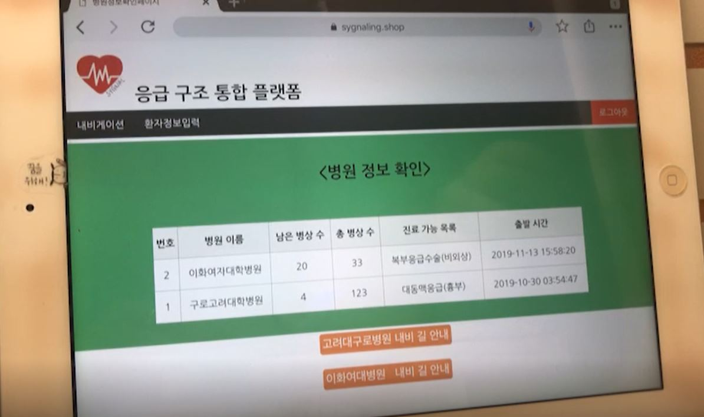

  
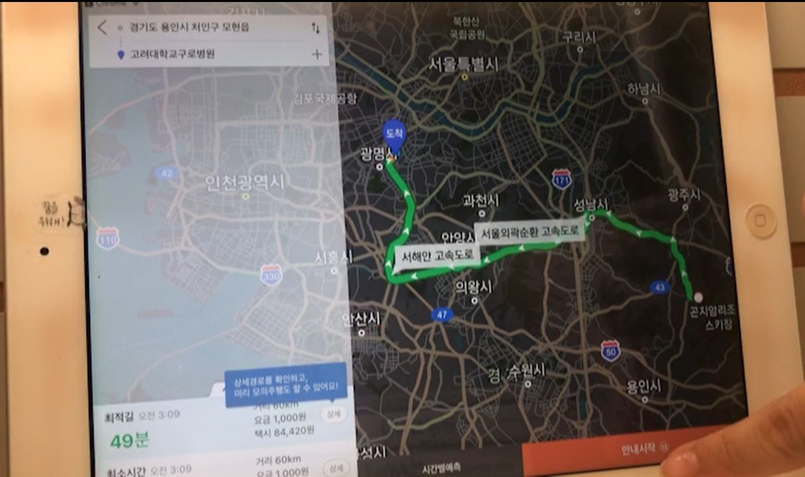

 ● (구급대용)이송중인 환자의 상태 공유를 위한 선택 페이지
 
 
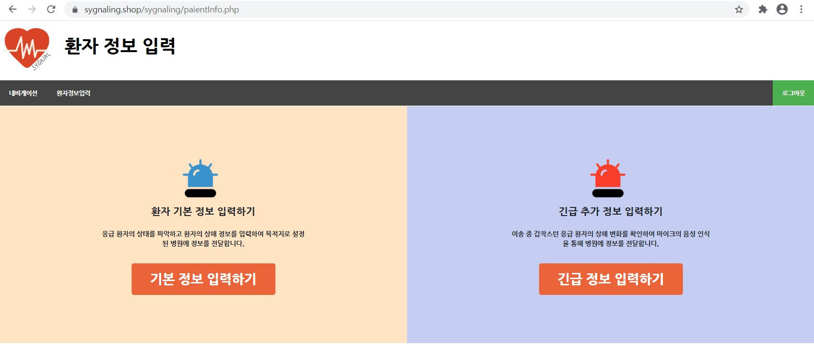

 
 ● (구급대용)이송중인 환자의 기본정보 입력하기(Modal)

  
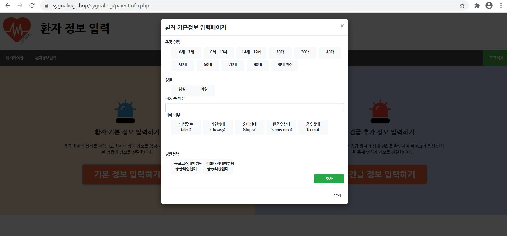

 ● (구급대용)이송중인 환자의 긴급추가정보 공유(STT)

 
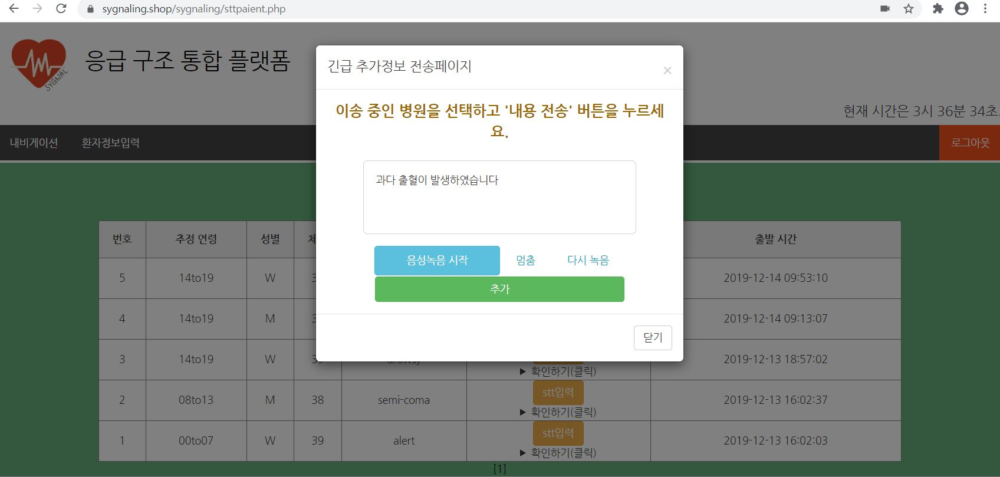

 ● 서울시 공공데이터 기반 응급사고 발생 예측
  
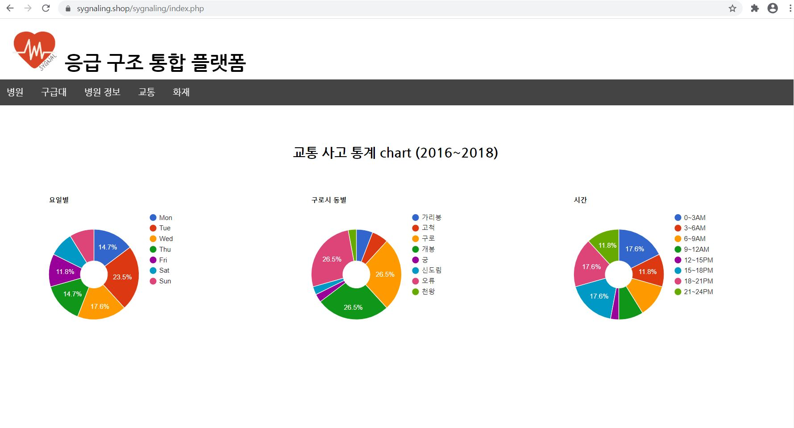

## 📑작품 구성도

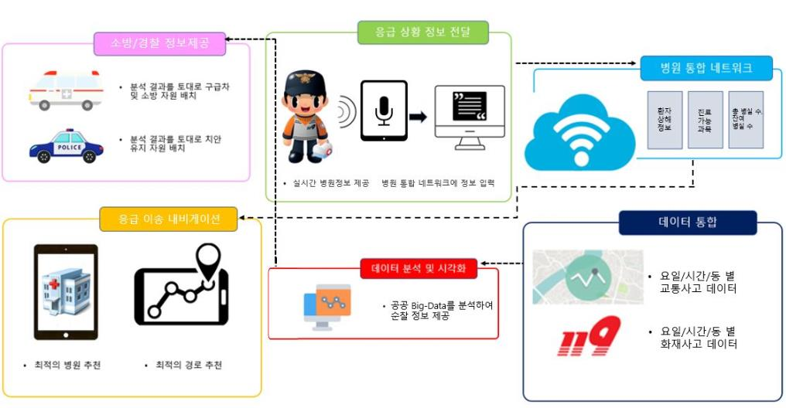

## 팀구성
### 유안지, 이수진, 김현주, 박정미

## 📑참고 사이트

##### annyang https://www.talater.com/annyang/ 
##### 공공 Data 포털 https://www.data.go.kr/ 
##### GIS 분석시스템 http://taas.koroad.or.kr/gis/mcm/mcl/initMap.do?menuId=GIS_GMP_STS_RSN 
##### Tmap API https://tmapapi.sktelecom.com/
